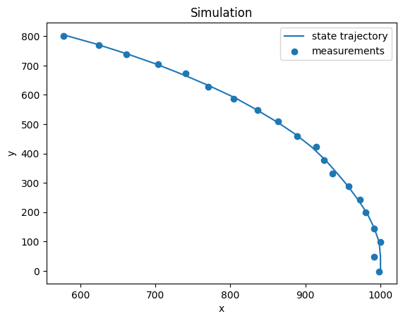

# AA 273: State Estimation

## Overview

- `ellipse.py / _error_ellipse` plots the P% error ellipse of a multivariate Gaussian.
- `kalman.py / filter` is a vanilla Kalman filter implementation. It should work for any set of system matrices, but the plotting code is application-specific.

## Requirements

Install JAX for numerical computing.

For GPU:

```sh
pip install --upgrade pip
pip install --upgrade jax jaxlib==0.1.65+cuda110 -f https://storage.googleapis.com/jax-releases/jax_releases.html
```

Make sure the `+cuda110` version aligns with your system installation. For example, I have CUDA 11.1 so I would do `+cuda111`. You can find all possible names at https://storage.googleapis.com/jax-releases/jax_releases.html.

For CPU:

```sh
pip install -U pip
pip install -U jax jaxlib
```

## Results




